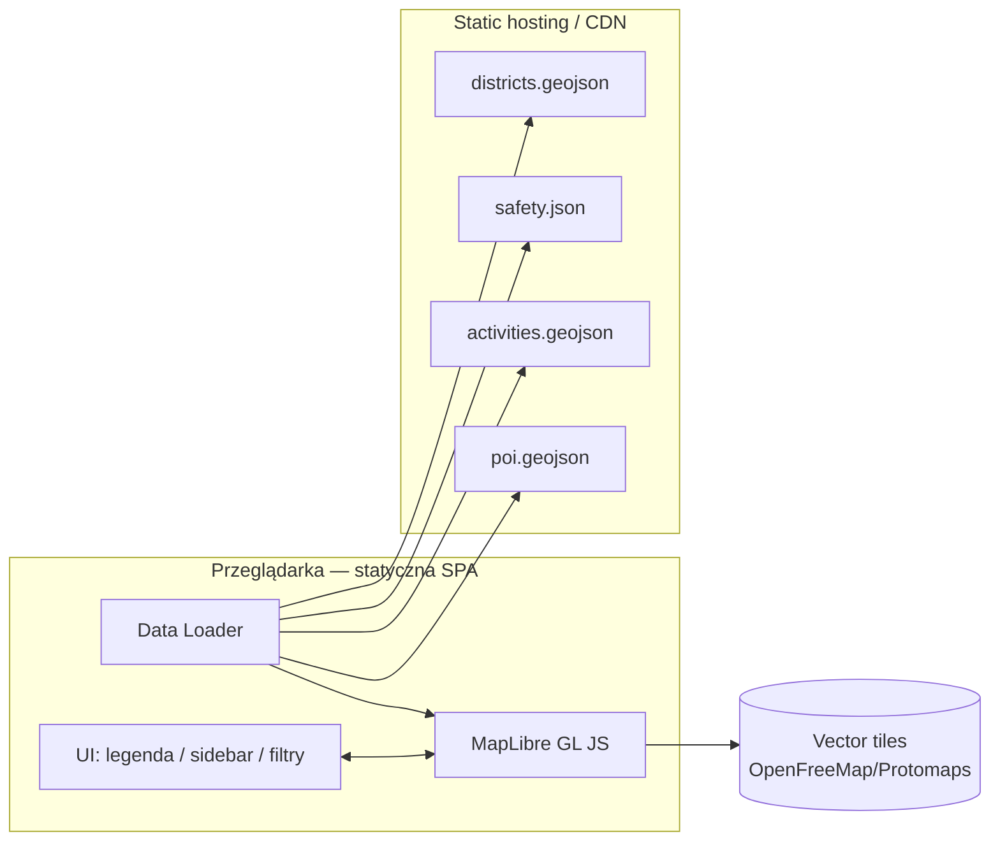
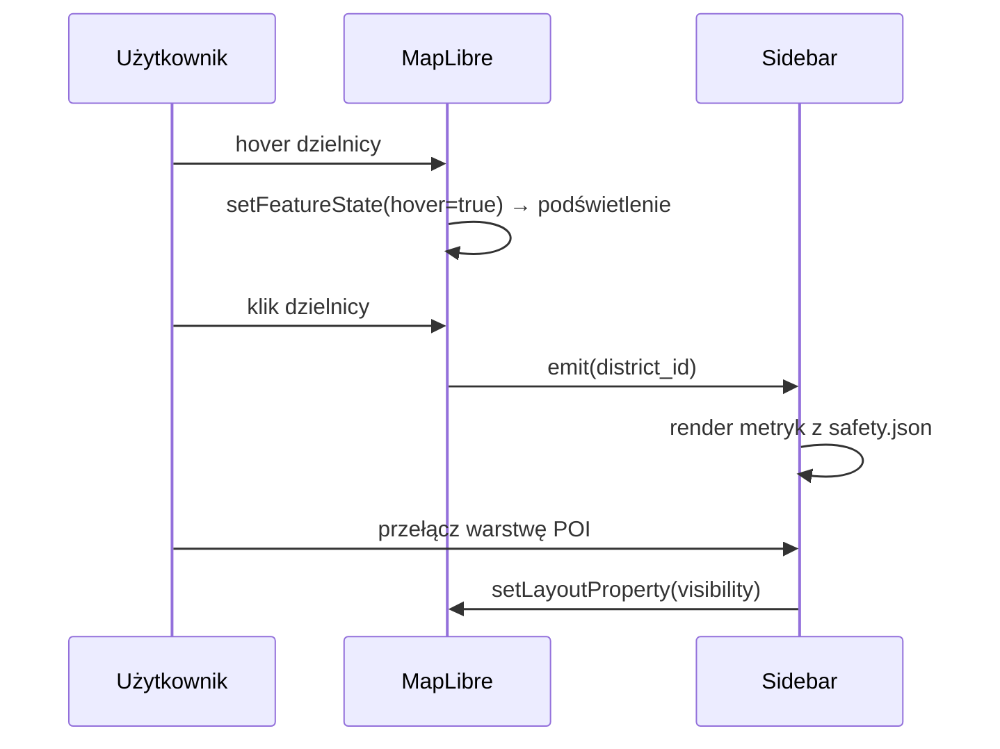
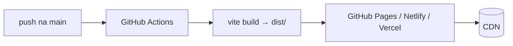
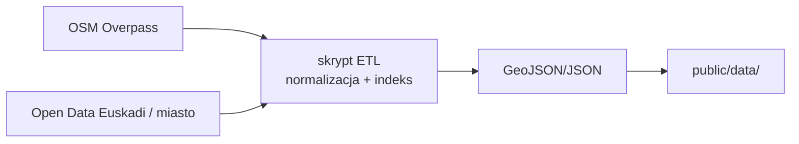

# ARD — Architecture & Design Document

**Projekt:** Bilbao Safety Map · **Wersja:** 0.1 · **Powiązane:** [PRD](PRD.md), [ROADMAP](ROADMAP.md)

---

## 1. Zasady architektury

1. **Static‑first** — MVP bez backendu. Wszystko to statyczne pliki serwowane z CDN.
2. **Lekkość** — minimum zależności, vanilla TS, tree‑shaking, brak ciężkich frameworków.
3. **Rozdział danych i prezentacji** — geometria (GeoJSON) osobno od metryk (JSON), łączone po `id`.
4. **Wektory > rastry** — kafle wektorowe (MapLibre) dla wydajności i ostrości.
5. **Progresywne wzbogacanie** — mapa działa z placeholderami; realne dane podmieniane bez zmian kodu.

## 2. Architektura wysokopoziomowa



**Brak serwera aplikacyjnego.** Dane generowane offline (ETL) i publikowane jako pliki.

## 3. Stack technologiczny

| Warstwa | Wybór | Uzasadnienie |
|---|---|---|
| Bundler / dev | Vite | Szybki HMR, mały output, ESM |
| Język | TypeScript | Typy dla GeoJSON / modeli danych |
| Silnik mapy | MapLibre GL JS | Open‑source fork Mapbox GL, GPU, wektory, brak tokenów |
| Basemap tiles | OpenFreeMap (styl `liberty`) / Protomaps | Darmowe, OSM, bez klucza API |
| Styl | Czysty CSS (custom properties) | Zero zależności, mały rozmiar |
| Dane | GeoJSON + JSON | Statyczne, cache‑owalne, proste |
| CI/CD | GitHub Actions → Pages/Netlify | Automatyczny deploy statyczny |

### Dlaczego MapLibre, a nie Leaflet?
Leaflet jest lekki, ale rastrowy i mniej wydajny przy wielu obiektach/choroplecie.
MapLibre renderuje wektory na GPU, obsługuje `feature-state` (szybki hover/select),
data‑driven styling i kafle wektorowe — lepsza płynność przy skalowaniu danych.

## 4. Model danych

### 4.1 Dzielnice — `districts.geojson`
```jsonc
{
  "type": "FeatureCollection",
  "features": [{
    "type": "Feature",
    "id": 1,
    "properties": { "id": 1, "name": "Abando", "code": "abando" },
    "geometry": { "type": "Polygon", "coordinates": [/* ... */] }
  }]
}
```

### 4.2 Bezpieczeństwo — `safety.json`
```jsonc
{
  "abando": {
    "safety_index": 82,      // 0–100, 100 = najbezpieczniej
    "day_score": 88,
    "night_score": 74,
    "incidents_per_1k": 12.3,
    "trend": "up",           // up | flat | down
    "summary": "Reprezentacyjne centrum, bardzo bezpieczne w dzień."
  }
}
```

### 4.3 Aktywności / POI — `activities.geojson`, `poi.geojson`
```jsonc
{
  "type": "Feature",
  "properties": {
    "id": "a-101", "name": "Parque Etxebarria",
    "category": "green",      // green | sport | culture | nightlife | food
    "district": "ibaiondo"
  },
  "geometry": { "type": "Point", "coordinates": [-2.923, 43.258] }
}
```

**Łączenie:** UI ładuje geometrię dzielnic i po `code`/`id` dołącza rekord z `safety.json`,
wpisując `safety_index` do `feature properties` przed dodaniem źródła do mapy.

## 5. Warstwy renderowania (MapLibre)

| Warstwa | Typ | Źródło | Uwagi |
|---|---|---|---|
| `districts-fill` | `fill` | districts | choropleth wg `safety_index` (interpolacja koloru) |
| `districts-outline` | `line` | districts | obrys, pogrubienie na hover/select via `feature-state` |
| `districts-label` | `symbol` | districts | nazwa dzielnicy |
| `places-clusters` | `circle` | places | klastry punktów (POI + aktywności) |
| `places-cluster-count` | `symbol` | places | liczność klastra |
| `places-points` | `symbol` | places | ikony (pinezki) wg `category`, filtrowalne |

> POI i aktywności są łączone w **jedno źródło `places`** — dzięki temu clustering i
> filtr kategorii działają spójnie (filtr przez podmianę danych źródła, respektowaną
> przez klastry). Kolory/ikony kategorii z `config.CATEGORY_COLORS`.

**Data‑driven color** (choropleth):
```
interpolate [linear] safety_index
  0   -> #d73027   (czerwony, niskie)
  50  -> #fee08b   (żółty)
  100 -> #1a9850   (zielony, wysokie)
```
Paleta diverging, sprawdzona pod kątem daltonizmu.

## 6. Struktura kodu

```
src/
├── main.ts            # bootstrap: init mapy + załaduj dane + zamontuj UI
├── map.ts             # MapLibre + wybór stylu z fallbackiem rastrowym
├── config.ts          # centrum/zoom, źródła, paleta, kategorie, fonty, fallback
├── markers.ts         # generowanie ikon kategorii (pinezki na kanwie)
├── data/loader.ts     # fetch + join geometrii z metrykami
├── layers/
│   ├── districts.ts   # warstwy dzielnic + hover/tooltip/click
│   ├── safety.ts      # wyrażenie koloru choropleth
│   └── places.ts      # POI + aktywności (klastry, ikony, filtr kategorii)
└── ui/
    ├── legend.ts      # legenda: bezpieczeństwo + kategorie
    ├── sidebar.ts     # panel szczegółów dzielnicy
    └── filters.ts     # przełączniki (per kategoria)
```

## 7. Przepływ interakcji



## 8. Optymalizacja i wydajność

- **Kafle wektorowe** zamiast rastrowych — mniejszy transfer, ostrość, GPU.
- **`feature-state`** dla hover/select — bez re‑renderu źródła.
- **Clustering POI** (`cluster: true`) — redukcja liczby rysowanych punktów.
- **Uproszczenie geometrii** granic (topojson/`mapshaper`) przed publikacją.
- **Lazy load** warstw aktywności/POI (dopiero po interakcji lub przy zoomie).
- **Code splitting** przez Vite; MapLibre ładowany raz, reszta on‑demand.
- **Cache** statycznych danych (immutable, hash w nazwie pliku po buildzie).
- **`prefers-color-scheme`** i przyjazne mobile (touch, `maxZoom`, `minZoom`).

## 9. Deployment



- Build statyczny → `dist/`. Hosting: GitHub Pages (darmowy) lub Netlify/Vercel.
- Brak sekretów w MVP (kafle bez klucza). Atrybucja OSM na mapie (wymóg ODbL).

## 10. Pipeline danych (ETL — poza aplikacją)



Skrypt ETL (np. Node/Python) pobiera granice i POI z OSM, statystyki z otwartych źródeł,
liczy `safety_index` (normalizacja min‑max + wagi), upraszcza geometrię i zapisuje pliki.
Uruchamiany manualnie/cronem — wynik commitowany do repo (dane wersjonowane).

## 11. Rozszerzalność (przyszłość)

- Opcjonalny backend/API dla danych na żywo lub crowdsourcingu.
- Podział na `barrios` (głębsza granularność) — ten sam model, więcej featerów.
- Warstwa czasowa (dzień/noc, sezon) przez `feature-state` / przełączniki.
- i18n (ES/EU/EN/PL) przez słowniki.
- PMTiles (Protomaps) — pełna kontrola nad kaflami, offline‑friendly.

## 12. Decyzje architektoniczne (ADR skrót)

| # | Decyzja | Alternatywa | Powód |
|---|---|---|---|
| 1 | MapLibre GL | Leaflet | Wektory, GPU, feature‑state, choropleth |
| 2 | Static‑first (bez backendu) | SSR/API | Prostota, koszt 0, cache, MVP |
| 3 | Vanilla TS | React/Vue | Rozmiar bundla, brak potrzeby reaktywności |
| 4 | Dane w repo (GeoJSON/JSON) | DB | Wersjonowanie, brak infrastruktury |
| 5 | OpenFreeMap tiles | Mapbox | Brak tokenów/kosztów, otwarte |
