# Roadmap — Bilbao Safety Map

Podejście iteracyjne: najpierw działający **pionowy plaster** (mapa + dzielnice +
bezpieczeństwo) na danych placeholder, potem realne dane i dopracowanie. Każda faza
kończy się wdrażalnym stanem.

**Legenda statusu:** ✅ zrobione · 🟡 częściowe / na danych placeholder · ⬜ do zrobienia

> ⚠️ **Kluczowe rozróżnienie:** Fazy 1–3 są zaimplementowane **na danych placeholder**.
> „Zrobione" oznacza działającą funkcję w UI — wiarygodność produktu zależy od **Fazy 4
> (realne dane + metodologia indeksu)**. Dlatego wprowadzono wczesny **Spike danych**.

---

## 🧭 Przegląd faz

```mermaid
gantt
    title Bilbao Safety Map — fazy
    dateFormat  X
    axisFormat %s
    section Fundament
    Faza 0 Setup + vertical slice :done, 0, 2
    section Ryzyko
    Spike danych (ETL/metodologia) :crit, 1, 2
    section MVP (placeholder)
    Faza 1 Dzielnice + bezpieczeństwo :done, 2, 2
    Faza 2 Aktywności + POI :done, 2, 2
    Faza 3 Filtry + UX :active, 4, 2
    section Realne dane
    Faza 4 ETL + realne dane :6, 3
    section Jakość / rozwój
    Faza 5 Optymalizacja :9, 2
    Faza 6 Backend/Community :11, 2
```

---

## Faza 0 — Setup + pionowy plaster ✅ *(w tym repo)*
Nie sam szkielet — działający, wdrażalny plaster funkcjonalny na danych placeholder.
- [x] Struktura repo, Vite + TS, MapLibre GL.
- [x] Dokumentacja: PRD, ARD, ROADMAP.
- [x] Placeholder danych (8 dzielnic + POI + aktywności).
- [x] CI (GitHub Actions) + workflow deploy na GitHub Pages.
- **DoD:** `npm run build` przechodzi; mapa Bilbao renderuje się lokalnie. ✅
- **Pozostaje:** włączyć Pages w `Settings → Pages → Source: GitHub Actions`.

## Spike danych — ETL / metodologia 🟡 *(nowy, priorytet)*
Największe ryzyko produktu (PRD: „brak/niska jakość danych" = ryzyko wysokie).
Uruchamiany **równolegle do Faz 1–3**, przed pełną Fazą 4.
- [ ] Potwierdzić źródło danych o bezpieczeństwie dla Bilbao (Open Data Euskadi / miasto / Eustat).
- [ ] Ustalić schemat i pokrycie (dzielnice? barrios? okres?).
- [ ] Zarys metodologii indeksu (normalizacja + wagi) — z góry jawnej i neutralnej.
- **DoD:** decyzja „są dane / zastępujemy proxy" + udokumentowana metodologia.

## Faza 1 — Dzielnice + bezpieczeństwo ✅ *(placeholder)*
- [x] Warstwa granic dzielnic (choropleth wg `safety_index`).
- [x] Interaktywna legenda bezpieczeństwa.
- [x] Hover‑podświetlenie + **tooltip** (nazwa, indeks).
- [x] Klik → panel dzielnicy (metryki + opis).
- [x] Responsywność (desktop/mobile).
- **DoD:** każda dzielnica klikalna, panel + choropleth czytelne na mobile. ✅
- **Zależność:** realne wartości indeksu → Faza 4.

## Faza 2 — Aktywności i miejsca warte zobaczenia ✅ *(placeholder)*
- [x] Warstwa POI + aktywności (wspólne źródło, kolor/ikona wg kategorii).
- [x] Ikony kategorii (pinezki generowane na kanwie).
- [x] Clustering punktów + rozwijanie klastra.
- [x] Popupy miejsc (nazwa, kategoria).
- [x] Legenda kategorii.
- **DoD:** punkty widoczne, klastrują się, mają legendę i popup. ✅
- **Zależność:** realne POI z OSM → Faza 4.

## Faza 3 — Filtry, warstwy i UX 🟡
- [x] Filtry per kategoria (zieleń/sport/kultura/nocne życie/gastronomia/warte zobaczenia).
- [x] Tryb ciemny (`prefers-color-scheme`).
- [ ] Wyszukiwarka dzielnicy.
- [ ] Przełącznik dzień/noc (bezpieczeństwo wg pory — dane `day_score`/`night_score` już są).
- [ ] Audyt dostępności (kontrast choropleth na mapie, nawigacja klawiaturą, ARIA).
- **DoD:** użytkownik kontroluje warstwy; Lighthouse Accessibility ≥ 90.

## Faza 4 — Realne dane i ETL ⬜
- [ ] Skrypt ETL: granice + POI z OSM (Overpass API).
- [ ] Import statystyk bezpieczeństwa (wynik Spike'u danych).
- [ ] Wyliczenie `safety_index` wg metodologii — jawnej w UI (transparentność).
- [ ] Uproszczenie geometrii (mapshaper) + wersjonowanie danych w repo.
- **DoD:** placeholdery zastąpione realnymi, cytowalnymi danymi; źródło widoczne w UI.

## Faza 5 — Optymalizacja i jakość ⬜
- [ ] Lazy loading warstw, code splitting, cache z hashami.
- [ ] Lighthouse ≥ 90 (Performance/Accessibility/SEO) — **zmierzone**, nie założone.
- [ ] Przegląd `npm audit` (obecnie 2 podatności, 1 high).
- [ ] Testy (jednostkowe loaderów/joinu, e2e krytycznej ścieżki).
- [ ] Kafle PMTiles/Protomaps (opcjonalnie, offline‑friendly, uniezależnienie od dostawcy).
- **DoD:** metryki potwierdzone, testy w CI, brak krytycznych podatności.

## Faza 6 — Opcjonalnie: backend / społeczność ⬜
- [ ] API / backend dla danych na żywo.
- [ ] Crowdsourcing (zgłaszanie/ocena miejsc) — z moderacją.
- [ ] i18n (ES/EU/EN/PL).
- [ ] Głębszy podział (barrios) i warstwa czasowa.
- **DoD:** wg potrzeb produktu.

---

## Kamienie milowe

| Milestone | Zakres | Kryterium ukończenia | Status |
|---|---|---|---|
| **M0 — Vertical slice** | Faza 0 | Build przechodzi, mapa renderuje się lokalnie | ✅ |
| **M1 — MVP (placeholder)** | Fazy 1–2 | Dzielnice + bezpieczeństwo + POI działają w UI | ✅ |
| **M1.5 — Deploy** | Pages | Mapa dostępna publicznie (GitHub Pages) | ⬜ |
| **M2 — Dane realne** | Spike + Fazy 3–4 | Rzeczywiste dane + metodologia + filtry | ⬜ |
| **M3 — Produkcja** | Faza 5 | Lighthouse ≥ 90 (zmierzone), testy, brak krytycznych CVE | ⬜ |
| **M4 — Rozwój** | Faza 6 | Wg potrzeb produktu | ⬜ |

---

## Znane ryzyka (z weryfikacji)
- **Zależność od zewnętrznego dostawcy kafli** (OpenFreeMap, bez SLA) — złagodzone
  fallbackiem rastrowym; docelowo własne PMTiles (Faza 5).
- **Dostępność danych o bezpieczeństwie** — adresowane przez wczesny Spike danych.
- **Placeholder geograficznie uproszczony** — jawnie oznaczony; zastępowany w Fazie 4.
- **Temat wrażliwy (stygmatyzacja dzielnic)** — neutralny język, jawna metodologia, źródła.
