# Roadmap — Bilbao Safety Map

Podejście iteracyjne: najpierw działająca mapa z podziałem na dzielnice i bezpieczeństwem,
potem kolejne warstwy i realne dane. Każda faza kończy się wdrażalnym stanem.

---

## 🧭 Przegląd faz

```mermaid
gantt
    title Bilbao Safety Map — fazy
    dateFormat  X
    axisFormat %s
    section Fundament
    Faza 0 Setup            :0, 1
    section MVP
    Faza 1 Mapa + dzielnice :1, 2
    Faza 2 Aktywności + POI :2, 2
    section Rozbudowa
    Faza 3 Filtry + UX      :4, 1
    Faza 4 Realne dane/ETL  :5, 2
    Faza 5 Optymalizacja    :7, 1
    section Opcjonalnie
    Faza 6 Backend/Community :8, 2
```

---

## Faza 0 — Setup (fundament) ✅ *(scaffold w tym repo)*
- [x] Struktura repo, Vite + TS, MapLibre.
- [x] Dokumentacja: PRD, ARD, ROADMAP.
- [x] Placeholder danych (8 dzielnic, przykładowe POI).
- [ ] CI (GitHub Actions) + deploy na GitHub Pages.
- **Rezultat:** uruchamialny szkielet z mapą Bilbao.

## Faza 1 — MVP: mapa + dzielnice + bezpieczeństwo 🎯
- [ ] Warstwa granic dzielnic (choropleth wg `safety_index`).
- [ ] Interaktywna legenda bezpieczeństwa.
- [ ] Hover‑podświetlenie + tooltip (nazwa, indeks).
- [ ] Klik → panel dzielnicy (metryki + opis).
- [ ] Responsywność (desktop/mobile).
- **Rezultat:** użytkownik rozumie bezpieczeństwo każdej dzielnicy.

## Faza 2 — Aktywności i miejsca warte zobaczenia
- [ ] Warstwa POI (atrakcje, punkty widokowe, zabytki) z ikonami.
- [ ] Warstwa aktywności (sport, kultura, zieleń, nocne życie).
- [ ] Clustering punktów przy oddaleniu.
- [ ] Popupy POI (nazwa, kategoria, dzielnica).
- **Rezultat:** mapa łączy bezpieczeństwo z „co robić / co zobaczyć”.

## Faza 3 — Filtry, warstwy i UX
- [ ] Przełączanie warstw i kategorii (panel filtrów).
- [ ] Wyszukiwarka dzielnicy.
- [ ] Przełącznik dzień/noc (bezpieczeństwo wg pory).
- [ ] Tryb ciemny + dopracowanie dostępności (WCAG AA, color‑blind safe).
- **Rezultat:** pełna kontrola nad tym, co widać na mapie.

## Faza 4 — Realne dane i ETL
- [ ] Skrypt ETL: granice + POI z OSM (Overpass).
- [ ] Import statystyk bezpieczeństwa z otwartych źródeł (Open Data Euskadi / miasto).
- [ ] Metodologia indeksu (normalizacja + wagi) — jawna w UI.
- [ ] Uproszczenie geometrii (mapshaper) + wersjonowanie danych.
- **Rezultat:** mapa oparta o rzeczywiste, cytowalne dane.

## Faza 5 — Optymalizacja i jakość
- [ ] Lazy loading warstw, code splitting, cache z hashami.
- [ ] Lighthouse ≥ 90 (Performance/Accessibility/SEO).
- [ ] Testy (jednostkowe loaderów, e2e krytycznej ścieżki).
- [ ] Kafle PMTiles/Protomaps (opcjonalnie, offline‑friendly).
- **Rezultat:** szybka, dopracowana, produkcyjna aplikacja.

## Faza 6 — Opcjonalnie: backend / społeczność
- [ ] API / backend dla danych na żywo.
- [ ] Crowdsourcing (zgłaszanie/ocena miejsc) — z moderacją.
- [ ] i18n (ES/EU/EN/PL).
- [ ] Głębszy podział (barrios) i warstwa czasowa.
- **Rezultat:** rozwój z MVP w pełny produkt.

---

## Kamienie milowe

| Milestone | Zakres | Kryterium ukończenia |
|---|---|---|
| **M0 — Scaffold** | Faza 0 | Mapa Bilbao renderuje się lokalnie |
| **M1 — MVP publiczny** | Fazy 1–2 | Deploy z dzielnicami, bezpieczeństwem, POI |
| **M2 — Dane realne** | Fazy 3–4 | Rzeczywiste dane + filtry + metodologia |
| **M3 — Produkcja** | Faza 5 | Lighthouse ≥ 90, testy, dokumentacja |
| **M4 — Rozwój** | Faza 6 | Wg potrzeb produktu |
